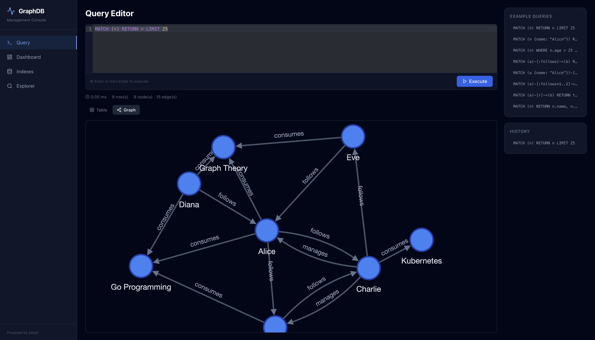

# GraphDB

A high-performance, embeddable graph database written in Go. Built on top of [bbolt](https://github.com/etcd-io/bbolt) (B+tree key-value store), it supports concurrent queries, secondary indexes, optional hash-based sharding, and a subset of the Cypher query language — all in a single dependency-free binary.



## Features

- **Directed labeled graph** — nodes and edges with arbitrary JSON-like properties  
  `alice ---follows---> bob`, `server ---consumes---> queue`
- **Node labels** — first-class `:Person`, `:Movie` labels with dedicated index and Cypher support (`MATCH (n:Person)`)
- **Concurrent reads** — fully parallel BFS, DFS, Cypher, and query-builder calls via MVCC
- **50 GB+ ready** — bbolt memory-mapped storage with configurable `MmapSize`
- **Graph algorithms** — BFS, DFS, Shortest Path (unweighted & Dijkstra), All Paths, Connected Components, Topological Sort
- **Fluent query builder** — chainable Go API with filtering, pagination, and direction control
- **Secondary indexes** — O(log N) property lookups with auto-maintenance on single writes
- **Composite indexes** — multi-property indexes for fast compound lookups (`CreateCompositeIndex("city", "age")`)
- **Unique constraints** — `CreateUniqueConstraint(label, property)` enforces value uniqueness across nodes with the same label; O(1) lookup via dedicated `idx_unique` bucket; WAL-replicated to followers
- **Bloom filter for HasEdge()** — in-memory probabilistic filter (~1.5 % false positive rate, zero false negatives) avoids disk I/O when edges definitely don't exist; rebuilt from `adj_out` on startup; `graphdb_bloom_negatives_total` Prometheus counter tracks savings
- **Cypher query language** — read and write support with index-aware execution, LIMIT push-down, ORDER BY + LIMIT heap, query plan caching, `OPTIONAL MATCH`, `EXPLAIN`/`PROFILE`, parameterized queries, `CREATE` for inserting nodes/edges, `MERGE` for upsert (match-or-create) semantics with `ON CREATE SET` / `ON MATCH SET`, `MATCH...SET` for property updates, `MATCH...DELETE` for node removal, `SKIP` for pagination
- **Query timeout** — `CypherContext`/`CypherWithParamsContext` accept `context.Context` for deadline-based cancellation at scan loop boundaries
- **Transactions** — `Begin`/`Commit`/`Rollback` API for multi-statement atomic operations with read-your-writes semantics
- **EXPLAIN / PROFILE** — query plan tree with operator types; `PROFILE` adds per-operator row counts and wall-clock timing
- **OPTIONAL MATCH** — left-outer-join semantics for graph patterns (unmatched bindings become `nil`)
- **Byte-budgeted node cache** — sharded concurrent LRU cache with memory-based eviction (default 128 MB); predictable memory footprint regardless of node sizes
- **Data integrity** — CRC32 (Castagnoli) checksums on all node/edge data, verified on every read, with a `VerifyIntegrity()` full scan
- **Binary encoding** — MessagePack property serialization (3–5× faster, 30–50% smaller than JSON) with backward-compatible format detection
- **Structured logging** — `log/slog` integration for all write operations, errors, and lifecycle events
- **Parameterized queries** — `$param` tokens in Cypher for safe substitution and plan reuse
- **Prepared statement caching** — bounded LRU query cache (10K entries) with `PrepareCypher`/`ExecutePrepared`/`ExecutePreparedWithParams` API and server-side `/api/cypher/prepare` + `/api/cypher/execute` endpoints
- **Streaming results** — `CypherStream()` returns a lazy `RowIterator` for O(1) memory on non-sorted queries; NDJSON streaming via `POST /api/cypher/stream`
- **Slow query log** — configurable threshold (default 100ms); queries exceeding the threshold are logged at WARN level with duration, row count, and truncated query text
- **Cursor pagination** — O(limit) cursor-based `ListNodes`/`ListEdges`/`ListNodesByLabel` APIs; no offset scanning. Server endpoints: `GET /api/nodes/cursor`, `GET /api/edges/cursor`
- **Prometheus metrics** — dependency-free atomic counters with Prometheus text exposition at `GET /metrics`; tracks queries, slow queries, cache hits/misses, node/edge CRUD, index lookups, and live gauges
- **Batch operations** — `AddNodeBatch` / `AddEdgeBatch` for bulk loading with single-fsync transactions
- **Worker pool** — built-in goroutine pool for concurrent query execution
- **Optional sharding** — hash-based partitioning across multiple bbolt files; edges co-located with source nodes for single-shard traversals
- **Single-leader replication** — WAL-based log shipping over gRPC with automatic leader election (hashicorp/raft), follower Applier, and exponential backoff reconnect; WAL group commit (batched fsync) for high write throughput
- **Transparent write forwarding** — followers automatically forward writes to the leader via HTTP; clients can connect to any node
- **Health check endpoint** — `GET /api/health` returns role-aware status (leader/follower/standalone) for load balancer integration
- **Cluster status endpoint** — `GET /api/cluster` exposes node ID, role, leader ID, and cluster topology
- **Cluster dashboard** — React UI page showing per-node stats, role indicators, replication progress bars, and health status with 5-second auto-refresh; aggregator endpoint proxies to all peers
- **Graceful shutdown** — `SIGTERM`/`SIGINT` signal handler with ordered teardown: HTTP drain (10 s) → Raft/gRPC stop → WAL flush → bbolt close; safe for Kubernetes pod termination and `Ctrl+C`
- **Management UI** — built-in web console with a Cypher query editor, interactive graph visualization (cytoscape.js), index management, and a node/edge explorer

## Installation

```bash
go get github.com/mstrYoda/goraphdb
```

## Quick Start

```go
package main

import (
    "fmt"
    "log"

    graphdb "github.com/mstrYoda/goraphdb"
)

func main() {
    // Open (or create) a database.
    db, err := graphdb.Open("./my.db", graphdb.DefaultOptions())
    if err != nil {
        log.Fatal(err)
    }
    defer db.Close()

    // Add nodes with arbitrary properties.
    alice, _ := db.AddNode(graphdb.Props{"name": "Alice", "age": 30})
    bob, _ := db.AddNode(graphdb.Props{"name": "Bob", "age": 25})

    // Add a directed labeled edge.
    db.AddEdge(alice, bob, "follows", graphdb.Props{"since": "2024"})

    // Query neighbors.
    neighbors, _ := db.NeighborsLabeled(alice, "follows")
    for _, n := range neighbors {
        fmt.Println(n.GetString("name")) // Bob
    }

    // BFS traversal.
    results, _ := db.BFSCollect(alice, 3, graphdb.Outgoing)
    for _, r := range results {
        fmt.Printf("depth=%d  %s\n", r.Depth, r.Node.GetString("name"))
    }

    // Cypher query.
    ctx := context.Background()
    res, _ := db.Cypher(ctx, `MATCH (a {name: "Alice"})-[:follows]->(b) RETURN b.name`)
    for _, row := range res.Rows {
        fmt.Println(row["b.name"]) // Bob
    }
}
```

## Configuration

```go
opts := graphdb.Options{
    ShardCount:         1,                      // 1 = single process (default), N = hash-sharded
    WorkerPoolSize:     8,                      // goroutines for concurrent query execution
    CacheBudget:        128 * 1024 * 1024,      // 128 MB byte-budget LRU cache for hot nodes
    SlowQueryThreshold: 100 * time.Millisecond, // log queries slower than this (0 = disabled)
    NoSync:             false,                  // true = skip fsync (faster writes, risk of data loss)
    ReadOnly:           false,                  // open in read-only mode
    MmapSize:           256 * 1024 * 1024,      // 256 MB initial mmap
}
db, err := graphdb.Open("./data", opts)
```

Use `graphdb.DefaultOptions()` for sensible defaults tuned for ~50 GB datasets.

## API Reference

### Node Operations

```go
// Create
id, err := db.AddNode(graphdb.Props{"name": "Alice", "age": 30})
ids, err := db.AddNodeBatch([]graphdb.Props{...})    // bulk insert (single tx)

// Read
node, err := db.GetNode(id)
name := node.GetString("name")      // "Alice"
age  := node.GetFloat("age")        // 30.0
exists, err := db.NodeExists(id)
count := db.NodeCount()

// Update
err = db.UpdateNode(id, graphdb.Props{"age": 31})    // merge
err = db.SetNodeProps(id, graphdb.Props{"name": "A"}) // full replace

// Delete
err = db.DeleteNode(id)              // also removes all connected edges

// Scan & Filter
nodes, err := db.FindNodes(func(n *graphdb.Node) bool {
    return n.GetFloat("age") > 25
})
err = db.ForEachNode(func(n *graphdb.Node) error {
    fmt.Println(n.Props)
    return nil
})
```

### Node Labels

```go
// Create a node with labels
id, err := db.AddNodeWithLabels([]string{"Person", "Employee"}, graphdb.Props{"name": "Alice"})

// Add / remove labels on existing nodes
err = db.AddLabel(id, "Admin")
err = db.RemoveLabel(id, "Employee")

// Query labels
labels, err := db.GetLabels(id)           // ["Person", "Admin"]
has, err := db.HasLabel(id, "Person")     // true

// Find all nodes with a label (index-backed)
people, err := db.FindByLabel("Person")
```

### Transactions

```go
// Multi-statement atomic operations with read-your-writes semantics.
tx, err := db.Begin()

alice, _ := tx.AddNode(graphdb.Props{"name": "Alice"})
bob, _ := tx.AddNode(graphdb.Props{"name": "Bob"})
tx.AddEdge(alice, bob, "follows", nil)

// Read uncommitted data within the same transaction.
node, _ := tx.GetNode(alice) // visible before commit

err = tx.Commit()   // atomically persists all changes
// — or —
err = tx.Rollback() // discards all changes
```

### Edge Operations

```go
// Create  —  alice ---follows---> bob
edgeID, err := db.AddEdge(alice, bob, "follows", graphdb.Props{"since": "2024"})
ids, err := db.AddEdgeBatch([]graphdb.Edge{...})

// Read
edge, err := db.GetEdge(edgeID)
outEdges, err := db.OutEdges(alice)                   // all outgoing
inEdges, err := db.InEdges(bob)                       // all incoming
allEdges, err := db.Edges(alice)                      // both directions
labeled, err := db.OutEdgesLabeled(alice, "follows")  // by label
byLabel, err := db.EdgesByLabel("follows")            // all edges with label
count := db.EdgeCount()

// Update
err = db.UpdateEdge(edgeID, graphdb.Props{"weight": 1.5})

// Delete
err = db.DeleteEdge(edgeID)

// Predicates
has, err := db.HasEdge(alice, bob)
has, err := db.HasEdgeLabeled(alice, bob, "follows")
deg, err := db.Degree(alice, graphdb.Outgoing)

// Neighbors
nodes, err := db.Neighbors(alice)                          // outgoing neighbors
nodes, err := db.NeighborsLabeled(alice, "follows")        // filtered by label
nodes, err := db.NeighborsDirection(alice, graphdb.Both)   // both directions
```

### Traversal Algorithms

```go
// BFS — breadth-first search with visitor callback
err = db.BFS(startID, maxDepth, graphdb.Outgoing, edgeFilter, func(r *graphdb.TraversalResult) bool {
    fmt.Printf("depth=%d node=%v\n", r.Depth, r.Node.Props["name"])
    return true // return false to stop early
})

// Convenience collectors
results, err := db.BFSCollect(startID, 3, graphdb.Outgoing)
results, err := db.DFSCollect(startID, 3, graphdb.Outgoing)

// Filtered traversals
results, err := db.BFSFiltered(startID, 3, graphdb.Outgoing, edgeFilter, nodeFilter)
results, err := db.DFSFiltered(startID, 3, graphdb.Outgoing, edgeFilter, nodeFilter)
```

### Pathfinding

```go
// Shortest path (unweighted BFS)
path, err := db.ShortestPath(from, to)
path, err := db.ShortestPathLabeled(from, to, "follows")

// Dijkstra (weighted)
path, err := db.ShortestPathWeighted(from, to, "weight", 1.0)

// All paths (up to maxDepth)
paths, err := db.AllPaths(from, to, 5)

// Connectivity
exists, err := db.HasPath(from, to)
components, err := db.ConnectedComponents()
sorted, err := db.TopologicalSort()  // Kahn's algorithm, errors on cycles
```

### Secondary Indexes

```go
// Create an index on a property (scans existing nodes)
err = db.CreateIndex("name")

// Fast lookup — O(log N) via B+tree prefix scan
nodes, err := db.FindByProperty("name", "Alice")

// Check if a property is indexed
indexed := db.HasIndex("name")

// Drop / rebuild
err = db.DropIndex("name")
err = db.ReIndex("name")
```

> **Index maintenance**: `AddNode`, `UpdateNode`, `SetNodeProps`, and `DeleteNode` automatically update indexes within the same transaction (zero extra fsync). `AddNodeBatch` skips auto-indexing for performance — call `CreateIndex()` or `ReIndex()` after batch inserts.

### Composite Indexes

```go
// Create a composite index on multiple properties (scans existing nodes)
err = db.CreateCompositeIndex("city", "age")

// Fast compound lookup — O(log N) via B+tree prefix scan
nodes, err := db.FindByCompositeIndex(map[string]any{"city": "Istanbul", "age": 30})

// Cypher queries use composite indexes automatically
// MATCH (n {city: "Istanbul", age: 30}) RETURN n  → composite index seek

// Management
has := db.HasCompositeIndex("city", "age")
indexes := db.ListCompositeIndexes() // [][]string
err = db.DropCompositeIndex("city", "age")
```

### Unique Constraints

```go
// Create a unique constraint: no two :Person nodes may share the same email.
err := db.CreateUniqueConstraint("Person", "email")

// Attempting to create a duplicate will fail.
_, _ = db.AddNodeWithLabels([]string{"Person"}, graphdb.Props{"email": "alice@example.com"})
_, err = db.AddNodeWithLabels([]string{"Person"}, graphdb.Props{"email": "alice@example.com"})
// err == graphdb.ErrUniqueConstraintViolation

// Fast O(1) lookup by unique constraint.
node, err := db.FindByUniqueConstraint("Person", "email", "alice@example.com")

// List all constraints.
constraints := db.ListUniqueConstraints() // []UniqueConstraint{{Label:"Person", Property:"email"}}

// Drop a constraint (existing duplicates are not retroactively checked).
err = db.DropUniqueConstraint("Person", "email")
```

Unique constraints are enforced during `AddNodeWithLabels`, `UpdateNode`, `SetNodeProps`, and `AddLabel`. Deleting a node frees its slot. Constraints are persisted in the `unique_meta` bucket and replicated via WAL.

### Cypher MERGE (Upsert)

```go
ctx := context.Background()

// MERGE: match-or-create. If a :Person with name "Alice" exists, match it;
// otherwise create it.
res, _ := db.Cypher(ctx, `MERGE (n:Person {name: "Alice"})`)

// ON CREATE SET — properties applied only when a new node is created.
res, _ = db.Cypher(ctx, `MERGE (n:Person {name: "Bob"}) ON CREATE SET n.created = "2026"`)

// ON MATCH SET — properties applied only when an existing node is matched.
res, _ = db.Cypher(ctx, `MERGE (n:Person {name: "Alice"}) ON MATCH SET n.updated = "2026"`)

// RETURN — returns the merged node.
res, _ = db.Cypher(ctx, `MERGE (n:Person {name: "Eve"}) ON CREATE SET n.role = "admin" RETURN n`)
```

> **Tip**: Combine `MERGE` with a unique constraint on the same `(label, property)` for efficient O(1) upsert instead of a full label scan.

### Prepared Statements & Query Cache

```go
// Prepare a parameterized query (parsed once, cached)
pq, err := db.PrepareCypher("MATCH (n {name: $name}) RETURN n")

ctx := context.Background()

// Execute with different parameters — no re-parsing
result, err := db.ExecutePreparedWithParams(ctx, pq, map[string]any{"name": "Alice"})
result, err = db.ExecutePreparedWithParams(ctx, pq, map[string]any{"name": "Bob"})

// Execute without parameters
result, err = db.ExecutePrepared(ctx, pq)

// Query cache statistics (bounded LRU, default 10K entries)
stats := db.QueryCacheStats()
fmt.Printf("hits=%d misses=%d entries=%d\n", stats.Hits, stats.Misses, stats.Entries)
```

### Streaming Results (Iterator)

```go
ctx := context.Background()

// CypherStream returns a lazy RowIterator — O(1) memory for non-sorted queries.
iter, err := db.CypherStream(ctx, "MATCH (n) RETURN n.name LIMIT 100")
if err != nil {
    log.Fatal(err)
}
defer iter.Close()

for iter.Next() {
    row := iter.Row()
    fmt.Println(row["n.name"])
}
if err := iter.Err(); err != nil {
    log.Fatal(err)
}

// Parameterized streaming
iter, err = db.CypherStreamWithParams(ctx,
    "MATCH (n {city: $city}) RETURN n.name",
    map[string]any{"city": "Istanbul"},
)
```

### Write Cypher (CREATE)

```go
ctx := context.Background()

// CREATE works through the unified Cypher() API — no separate function needed.
result, err := db.Cypher(ctx, `CREATE (n:Person {name: "Alice", age: 30}) RETURN n`)
node := result.Rows[0]["n"].(*graphdb.Node) // access created node

// Create two nodes and an edge in one statement.
db.Cypher(ctx, `CREATE (a:Person {name: "Alice"})-[:FOLLOWS]->(b:Person {name: "Bob"})`)

// Multiple comma-separated patterns.
db.Cypher(ctx, `CREATE (a:City {name: "Istanbul"}), (b:City {name: "Ankara"})`)

// CREATE without RETURN — fire-and-forget.
db.Cypher(ctx, `CREATE (n:Movie {title: "The Matrix", year: 1999})`)

// Dedicated API with creation statistics.
cr, _ := db.CypherCreate(ctx, `CREATE (n:Person {name: "Eve"}) RETURN n`)
fmt.Println(cr.Stats.NodesCreated) // 1
fmt.Println(cr.Stats.LabelsSet)    // 1
fmt.Println(cr.Stats.PropsSet)     // 1
```

### Query Timeout & Cancellation

```go
// All query methods accept context.Context as the first argument for
// timeout/cancellation. The context is checked at key iteration points
// (full scans, edge traversals, index scans).

ctx, cancel := context.WithTimeout(context.Background(), 500*time.Millisecond)
defer cancel()

result, err := db.Cypher(ctx, `MATCH (n) RETURN n`)
if errors.Is(err, context.DeadlineExceeded) {
    log.Println("query timed out")
}

// Parameterized queries also accept context:
result, err = db.CypherWithParams(ctx,
    "MATCH (n {name: $name}) RETURN n",
    map[string]any{"name": "Alice"},
)
```

### Cursor Pagination

```go
// List nodes with cursor-based pagination — O(limit) per page, no offset scan.
page, err := db.ListNodes(0, 20) // first page, 20 nodes
for _, n := range page.Nodes {
    fmt.Printf("id=%d name=%s\n", n.ID, n.GetString("name"))
}

// Next page: pass the cursor from the previous page.
if page.HasMore {
    page2, _ := db.ListNodes(page.NextCursor, 20)
    // ...
}

// Edges and label-filtered nodes also supported.
edgePage, _ := db.ListEdges(0, 50)
labelPage, _ := db.ListNodesByLabel("Person", 0, 20)
```

### Slow Query Log

```go
// Queries exceeding SlowQueryThreshold are logged at WARN level automatically.
opts := graphdb.DefaultOptions()
opts.SlowQueryThreshold = 50 * time.Millisecond // default: 100ms, 0 = disabled

// Log output (slog):
// WARN slow query detected query="MATCH (n) RETURN n" duration=152ms rows=50000
```

### Prometheus Metrics

```go
// All metrics are atomic counters — zero contention, no external dependencies.
m := db.Metrics()

// Programmatic access
snap := m.Snapshot() // map[string]any with all counters + live gauges

// Prometheus text exposition (for /metrics endpoint or manual use)
m.WritePrometheus(os.Stdout)
// Output:
// # HELP graphdb_queries_total Total number of Cypher query executions
// # TYPE graphdb_queries_total counter
// graphdb_queries_total 42
// ...
```

Available metrics:
- **Counters**: `graphdb_queries_total`, `graphdb_slow_queries_total`, `graphdb_query_errors_total`, `graphdb_cache_hits_total`, `graphdb_cache_misses_total`, `graphdb_nodes_created_total`, `graphdb_nodes_deleted_total`, `graphdb_edges_created_total`, `graphdb_edges_deleted_total`, `graphdb_index_lookups_total`, `graphdb_bloom_negatives_total`
- **Gauges**: `graphdb_nodes_current`, `graphdb_edges_current`, `graphdb_node_cache_bytes_used`, `graphdb_node_cache_budget_bytes`, `graphdb_query_cache_entries`, `graphdb_query_cache_capacity`

### Fluent Query Builder

```go
result, err := db.NewQuery().
    From(alice).
    FollowEdge("follows").
    Dir(graphdb.Outgoing).
    Depth(3).
    Where(func(n *graphdb.Node) bool {
        return n.GetFloat("age") > 25
    }).
    Limit(10).
    Offset(0).
    UseBFS().        // or .UseDFS()
    Execute()

for _, node := range result.Nodes {
    fmt.Println(node.GetString("name"))
}
```

### Concurrent Queries

```go
ctx := context.Background()

// Run multiple queries in parallel using the built-in worker pool.
results, err := db.NewConcurrentQuery().
    Add(db.NewQuery().From(alice).FollowEdge("follows").Depth(2)).
    Add(db.NewQuery().From(bob).FollowEdge("follows").Depth(2)).
    Execute(ctx)

// Or run arbitrary functions concurrently.
values, errs := db.ExecuteFunc(ctx,
    func() (interface{}, error) { return db.ShortestPath(alice, charlie) },
    func() (interface{}, error) { return db.BFSCollect(bob, 3, graphdb.Outgoing) },
)
```

### Cypher Query Language

GraphDB supports a read-only subset of the [Cypher](https://neo4j.com/docs/cypher-manual/current/) query language with index-aware execution, LIMIT push-down, and query plan caching.

#### Supported Patterns

```go
ctx := context.Background()

// 1. All nodes
res, _ := db.Cypher(ctx, `MATCH (n) RETURN n`)

// 2. Property filter (uses index if available)
res, _ = db.Cypher(ctx, `MATCH (n {name: "Alice"}) RETURN n`)

// 3. WHERE clause
res, _ = db.Cypher(ctx, `MATCH (n) WHERE n.age > 25 RETURN n`)

// 4. Single-hop pattern match
res, _ = db.Cypher(ctx, `MATCH (a)-[:follows]->(b) RETURN a, b`)

// 5. Filtered traversal with property projection
res, _ = db.Cypher(ctx, `MATCH (a {name: "Alice"})-[:follows]->(b) RETURN b.name`)

// 6. Variable-length path (1 to 3 hops)
res, _ = db.Cypher(ctx, `MATCH (a)-[:follows*1..3]->(b) RETURN b`)

// 7. Any edge type with type() function
res, _ = db.Cypher(ctx, `MATCH (a)-[r]->(b) RETURN type(r), b`)

// 8. Label-based matching (index-backed)
res, _ = db.Cypher(ctx, `MATCH (n:Person) RETURN n`)
res, _ = db.Cypher(ctx, `MATCH (a:Person)-[:follows]->(b:Person) RETURN a, b`)

// 9. OPTIONAL MATCH — left-outer-join (nil when no match)
res, _ = db.Cypher(ctx, `MATCH (n:Person) OPTIONAL MATCH (n)-[r:WROTE]->(b) RETURN n.name, b`)
```

#### EXPLAIN / PROFILE

```go
// EXPLAIN — returns the query plan without executing (zero I/O)
res, _ := db.Cypher(ctx, `EXPLAIN MATCH (n:Person) WHERE n.age > 25 RETURN n`)
fmt.Println(res.Plan.String())
// EXPLAIN:
// └── ProduceResults (n)
//     └── Filter (WHERE clause)
//         └── NodeByLabelScan (n:Person)

// PROFILE — executes and returns the plan annotated with actual row counts + timing
res, _ = db.Cypher(ctx, `PROFILE MATCH (n:Person) RETURN n`)
fmt.Println(res.Plan.String())
// PROFILE:
// └── ProduceResults (n) [rows=42, time=150µs]
//     └── NodeByLabelScan (n:Person) [rows=42]

// The actual query results are still available:
for _, row := range res.Rows {
    fmt.Println(row["n"])
}
```

#### Parameterized Queries

```go
// Use $param tokens to prevent injection and enable plan caching.
res, _ := db.CypherWithParams(ctx,
    `MATCH (n {name: $name}) WHERE n.age > $minAge RETURN n`,
    map[string]any{"name": "Alice", "minAge": 25},
)
```

#### ORDER BY, LIMIT, Prepared Queries

```go
ctx := context.Background()

// ORDER BY + LIMIT — uses a min-heap for top-K efficiency
res, _ := db.Cypher(ctx, `MATCH (n) WHERE n.age > 20 RETURN n.name ORDER BY n.age DESC LIMIT 5`)

// LIMIT push-down — stops scanning early when no ORDER BY is present
res, _ = db.Cypher(ctx, `MATCH (n) RETURN n LIMIT 10`)

// Prepared queries — parse once, execute many times
pq, _ := db.PrepareCypher(`MATCH (n {name: "Alice"})-[:follows]->(b) RETURN b.name`)
res1, _ := db.ExecutePrepared(ctx, pq)
res2, _ := db.ExecutePrepared(ctx, pq) // no re-parsing

// Results
for _, row := range res.Rows {
    fmt.Println(row["n.name"], row["n.age"])
}
```

### Statistics

```go
stats, err := db.Stats()
fmt.Printf("Nodes: %d, Edges: %d, Shards: %d, Disk: %.1f MB\n",
    stats.NodeCount, stats.EdgeCount, stats.ShardCount,
    float64(stats.DiskSizeBytes)/1024/1024)
```

### Data Integrity

```go
// Verify all node and edge data across all shards (CRC32 checksums).
report, err := db.VerifyIntegrity()
fmt.Printf("Checked %d nodes, %d edges\n", report.NodesChecked, report.EdgesChecked)

if report.OK() {
    fmt.Println("All data intact!")
} else {
    for _, e := range report.Errors {
        fmt.Println(e) // "shard 0, nodes[00000001]: props checksum mismatch ..."
    }
}
```

## Replication

GraphDB supports **single-leader replication** with automatic failover. One node accepts all writes (the leader), while multiple read replicas (followers) serve read queries for horizontal read scaling.

### Architecture

```
┌─────────────────────────────────────────────────────────────────┐
│                      Replication Cluster                        │
│                                                                 │
│  ┌──────────────┐   gRPC StreamWAL   ┌──────────────┐          │
│  │    Leader     │ ────────────────► │  Follower 1   │          │
│  │              │                    │              │          │
│  │  Writes ──► WAL ──────────────► │  Applier ──► DB│          │
│  │              │                    └──────────────┘          │
│  │              │   gRPC StreamWAL   ┌──────────────┐          │
│  │              │ ────────────────► │  Follower 2   │          │
│  │              │                    │              │          │
│  │              │                    │  Applier ──► DB│          │
│  └──────┬───────┘                    └──────────────┘          │
│         │                                                       │
│         │ Raft (leader election only)                           │
│         └──────── heartbeats ──────── all nodes                 │
│                                                                 │
│  Query Router:                                                  │
│    MATCH  → any node (local)                                    │
│    CREATE → leader (forwarded via HTTP if received by follower) │
└─────────────────────────────────────────────────────────────────┘
```

### Components

| Component | File(s) | Purpose |
|---|---|---|
| **WAL** | `wal.go`, `wal_entry.go` | Append-only log of all committed mutations. Segmented (64 MB), CRC32 checksums, msgpack encoding. Monotonic LSN for ordering. |
| **Applier** | `applier.go` | Replays WAL entries on followers. Deterministic (uses leader's IDs), idempotent (skips duplicate LSNs), sequential. |
| **Log Shipping** | `replication/server.go`, `replication/client.go` | gRPC server-streaming RPC. Leader streams WAL entries; follower applies them via the Applier. Auto-reconnect with exponential backoff. |
| **Leader Election** | `replication/election.go` | hashicorp/raft integration for automatic leader election and failover. Raft is used only for election — data flows through the WAL pipeline. |
| **Cluster Manager** | `replication/cluster.go` | Orchestrates Raft election, gRPC replication server/client, and role changes. Manages peer addresses and dynamic leader discovery. |
| **Query Router** | `replication/router.go` | Routes reads locally, forwards writes to the leader via HTTP. Integrates with election for dynamic leader discovery. |
| **Health & Status** | `server/server.go` | `GET /api/health` (LB readiness) and `GET /api/cluster` (topology introspection) endpoints. |

### Configuration

```go
// Leader node
leader, _ := graphdb.Open("./data", graphdb.Options{
    ShardCount: 4,
    EnableWAL:  true,
    Role:       "leader",
})

// Follower node
follower, _ := graphdb.Open("./data-replica", graphdb.Options{
    ShardCount: 4,
    Role:       "follower",  // rejects all direct writes
})
```

### Roles

- **`""` or `"standalone"`** — default, no replication. WAL is optional.
- **`"leader"`** — accepts writes, records to WAL, ships entries to followers.
- **`"follower"`** — read-only. All public write methods return `ErrReadOnlyReplica`. Only the internal Applier can write.

Roles can be changed at runtime via `db.SetRole("leader")` — used by the Raft election callback when leadership changes.

### WAL Format

```
┌──────────┬──────────────────┬──────────┐
│ 4B length│ msgpack WALEntry  │ 4B CRC32 │  ← one frame
└──────────┴──────────────────┴──────────┘
```

- **Segment files**: `wal-0000000000.log`, `wal-0000000001.log`, …
- **Rotation**: new segment at 64 MB
- **18 operation types**: AddNode, AddNodeBatch, UpdateNode, SetNodeProps, DeleteNode, AddEdge, AddEdgeBatch, DeleteEdge, UpdateEdge, AddNodeWithLabels, AddLabel, RemoveLabel, CreateIndex, DropIndex, CreateCompositeIndex, DropCompositeIndex, CreateUniqueConstraint, DropUniqueConstraint
- **Tailing**: WALReader supports live tailing — returns `io.EOF` at the end of the active segment, resumes on next call when new data is appended
- **Group commit**: Background goroutine batches `fsync` calls (2 ms interval by default); writes are buffered to the OS immediately but fsynced in groups, eliminating per-write fsync serialization that otherwise caps throughput at ~80 ops/s

### Write Forwarding

When a follower's Router receives a write request:
1. The local DB rejects it with `ErrReadOnlyReplica`
2. The Router serializes the operation as JSON
3. The operation is forwarded to the leader's `/api/write` HTTP endpoint
4. The leader executes it locally and returns the result
5. The mutation flows back to followers via the WAL → gRPC pipeline

### Running a Cluster

Start a 3-node cluster using the `graphdb-ui` binary:

```bash
# Node 1 — will bootstrap as leader
go run ./cmd/graphdb-ui/ -db ./data1 \
  -node-id node1 -raft-addr 127.0.0.1:9001 -grpc-addr 127.0.0.1:9101 -http-addr 127.0.0.1:7474 \
  -bootstrap \
  -peers "node1@127.0.0.1:9001@127.0.0.1:9101@127.0.0.1:7474,node2@127.0.0.1:9002@127.0.0.1:9102@127.0.0.1:7475,node3@127.0.0.1:9003@127.0.0.1:9103@127.0.0.1:7476" \
  -addr 127.0.0.1:7474

# Node 2 — follower
go run ./cmd/graphdb-ui/ -db ./data2 \
  -node-id node2 -raft-addr 127.0.0.1:9002 -grpc-addr 127.0.0.1:9102 -http-addr 127.0.0.1:7475 \
  -bootstrap \
  -peers "node1@127.0.0.1:9001@127.0.0.1:9101@127.0.0.1:7474,node2@127.0.0.1:9002@127.0.0.1:9102@127.0.0.1:7475,node3@127.0.0.1:9003@127.0.0.1:9103@127.0.0.1:7476" \
  -addr 127.0.0.1:7475

# Node 3 — follower
go run ./cmd/graphdb-ui/ -db ./data3 \
  -node-id node3 -raft-addr 127.0.0.1:9003 -grpc-addr 127.0.0.1:9103 -http-addr 127.0.0.1:7476 \
  -bootstrap \
  -peers "node1@127.0.0.1:9001@127.0.0.1:9101@127.0.0.1:7474,node2@127.0.0.1:9002@127.0.0.1:9102@127.0.0.1:7475,node3@127.0.0.1:9003@127.0.0.1:9103@127.0.0.1:7476" \
  -addr 127.0.0.1:7476
```

Peer format: `id@raft_addr@grpc_addr@http_addr` (comma-separated).

Clients can connect to **any node** — reads are served locally, writes are transparently forwarded to the leader.

### Observability Endpoints

| Endpoint | Method | Purpose |
|---|---|---|
| `/api/health` | GET | Load balancer health probe. Returns `200` with `role` for routing; returns `200` with `status: "readonly"` on quorum loss (stale reads). |
| `/api/cluster` | GET | Cluster topology: node ID, role (leader/follower), current leader ID, DB role, addresses, LSN. |
| `/api/cluster/nodes` | GET | Aggregated view of all cluster nodes — proxies to each peer's health, stats, metrics, and cluster endpoints. |
| `/api/constraints` | GET | List all unique constraints. |
| `/api/constraints` | POST | Create a unique constraint (`{"label": "...", "property": "..."}`). |
| `/api/constraints` | DELETE | Drop a unique constraint (`{"label": "...", "property": "..."}`). |

## Architecture

```
┌──────────────────────────────────────────────────────────────┐
│                     Management UI                            │
│   React + TypeScript + Tailwind · cytoscape.js · CodeMirror  │
│   Query Editor · Dashboard · Indexes · Explorer              │
├──────────────────────────────────────────────────────────────┤
│                    HTTP / JSON API                            │
│   /api/cypher · /api/nodes · /api/edges · /api/indexes       │
│   /api/stats · /api/health · /api/cluster · /api/write       │
├──────────────────────────────────────────────────────────────┤
│                     Replication Layer                         │
│   WAL · gRPC Log Shipping · Applier · Raft Election          │
│   Query Router · Write Forwarding · Role Management          │
├──────────────────────────────────────────────────────────────┤
│                        Public API                            │
│   Node/Edge CRUD · Labels · Transactions (Begin/Commit)      │
│   BFS/DFS · Paths · Query Builder · VerifyIntegrity          │
├──────────────────────────────────────────────────────────────┤
│                     Cypher Engine                            │
│   Lexer → Parser → AST → Executor (index-aware)             │
│   EXPLAIN/PROFILE · OPTIONAL MATCH · Parameterized ($param)  │
│   Query plan cache · LIMIT push-down · Top-K heap           │
├──────────────────────────────────────────────────────────────┤
│                    Shard Manager                             │
│   Hash-based routing · Cross-shard edge handling             │
│   Worker pool · Sharded LRU node cache                       │
├──────────────────────────────────────────────────────────────┤
│                   Storage Layer                              │
│   bbolt (B+tree) · Memory-mapped files · MVCC               │
│   MessagePack encoding · CRC32 checksums · Labels index      │
├──────────────────────────────────────────────────────────────┤
│ nodes│edges│adj_*│idx_prop│idx_edge│labels│idx_lbl│idx_uniq│
└──────────────────────────────────────────────────────────────┘
```

### Storage Layout (bbolt buckets)

| Bucket | Key | Value | Purpose |
|---|---|---|---|
| `nodes` | `uint64 nodeID` | MessagePack props + CRC32 | Node data |
| `edges` | `uint64 edgeID` | Binary edge + CRC32 | Edge data (from, to, label, props) |
| `adj_out` | `nodeID \| edgeID` | `targetID \| label` | Outgoing adjacency list |
| `adj_in` | `nodeID \| edgeID` | `sourceID \| label` | Incoming adjacency list |
| `idx_prop` | `"prop:value" \| nodeID` | ∅ | Secondary property index |
| `idx_edge_type` | `"label" \| edgeID` | ∅ | Edge type index |
| `node_labels` | `uint64 nodeID` | MessagePack `[]string` | Node label storage |
| `idx_node_label` | `"label" \| nodeID` | ∅ | Label → node index |
| `idx_unique` | `"label\0property\0value"` | `uint64 nodeID` | Unique constraint value index |
| `unique_meta` | `"label\0property"` | ∅ | Unique constraint metadata |
| `meta` | `"node_counter"` / `"edge_counter"` | `uint64` | ID allocation counters |

### Concurrency Model

- **Reads** are fully parallel — `GetNode`, `BFS`, `Cypher`, etc. never acquire a mutex. bbolt's MVCC provides snapshot isolation.
- **Writes** are serialized per-shard by bbolt's single-writer lock.
- The `closed` flag is an `atomic.Bool` — checked by every operation without locking.
- A built-in worker pool (default 8 goroutines) dispatches concurrent queries.

### Sharding

When `ShardCount > 1`, node IDs are hash-partitioned (`nodeID % shardCount`) across separate bbolt files:

- **Edges** are co-located with their source node → `OutEdges(x)` hits **1 shard**.
- **Incoming adjacency** is stored in the target node's shard → `InEdges(x)` hits **1 shard**.
- Cross-shard edge creation uses two separate transactions (two fsyncs) instead of one.

For most use cases, `ShardCount: 1` (default) is sufficient and avoids cross-shard overhead.

## Management UI

GraphDB ships with a built-in web-based management console for exploring your data visually.

### Running the UI

```bash
# Build the React frontend (one-time)
cd ui && npm install && npm run build && cd ..

# Start the server (serves both the API and the UI)
go run ./cmd/graphdb-ui/ -db ./my-data.db -ui ./ui/dist
# → Open http://localhost:7474
```

For development with hot-reload:

```bash
# Terminal 1 — Go API server
go run ./cmd/graphdb-ui/ -db ./my-data.db

# Terminal 2 — React dev server (auto-proxies API calls)
cd ui && npm run dev
# → Open http://localhost:5173
```

### Pages

| Page | What it does |
|---|---|
| **Query Editor** | Write and run Cypher queries with syntax highlighting. Results are shown as a table or as an interactive graph. Includes example queries and keeps a history of past queries. Press `Ctrl+Enter` to execute. |
| **Dashboard** | See your database at a glance — total nodes, edges, shard count, disk usage, and which indexes are active. Quick links to other pages. |
| **Index Management** | Create, drop, or rebuild property indexes through the UI. Each index is shown with its type (B+tree) and status. |
| **Graph Explorer** | Browse all nodes in a paginated list. Click any node to see its properties and a visual graph of its direct connections. Click nodes in the graph to navigate and explore further. |

### REST API

The UI communicates through a JSON API that you can also use directly:

```bash
# Database stats
curl http://localhost:7474/api/stats

# Run a Cypher query
curl -X POST http://localhost:7474/api/cypher \
  -d '{"query": "MATCH (n) RETURN n LIMIT 10"}'

# List indexes
curl http://localhost:7474/api/indexes

# Create an index
curl -X POST http://localhost:7474/api/indexes \
  -d '{"property": "name"}'

# List nodes (paginated)
curl http://localhost:7474/api/nodes?limit=20&offset=0

# Update a node's properties (merge)
curl -X PUT http://localhost:7474/api/nodes/1 \
  -d '{"props": {"age": 31, "city": "Istanbul"}}'

# Get a node's neighborhood (node + neighbors + edges)
curl http://localhost:7474/api/nodes/1/neighborhood

# Create a node
curl -X POST http://localhost:7474/api/nodes \
  -d '{"props": {"name": "Alice", "age": 30}}'

# Create an edge
curl -X POST http://localhost:7474/api/edges \
  -d '{"from": 1, "to": 2, "label": "follows"}'

# Cursor pagination (O(limit) per page)
curl 'http://localhost:7474/api/nodes/cursor?limit=20'
curl 'http://localhost:7474/api/nodes/cursor?cursor=42&limit=20'
curl 'http://localhost:7474/api/edges/cursor?limit=50'

# Prepare and execute a statement
curl -X POST http://localhost:7474/api/cypher/prepare \
  -d '{"query": "MATCH (n {name: $name}) RETURN n"}'
curl -X POST http://localhost:7474/api/cypher/execute \
  -d '{"stmt_id": "abc123", "params": {"name": "Alice"}}'

# NDJSON streaming
curl -X POST http://localhost:7474/api/cypher/stream \
  -d '{"query": "MATCH (n) RETURN n.name LIMIT 100"}'

# Unique constraints
curl http://localhost:7474/api/constraints
curl -X POST http://localhost:7474/api/constraints \
  -d '{"label": "Person", "property": "email"}'
curl -X DELETE http://localhost:7474/api/constraints \
  -d '{"label": "Person", "property": "email"}'

# Prometheus metrics
curl http://localhost:7474/metrics

# Query cache stats
curl http://localhost:7474/api/cache/stats

# Health check (load balancer probe)
curl http://localhost:7474/api/health
# → {"status":"ok","role":"standalone"}               (standalone)
# → {"status":"ok","role":"leader","node_id":"node1"}  (cluster leader)
# → {"status":"ok","role":"follower","node_id":"node2"} (cluster follower)

# Cluster status (topology introspection)
curl http://localhost:7474/api/cluster
# → {"mode":"cluster","node_id":"node1","role":"leader","leader_id":"node1","db_role":"leader"}
```

### Tech Stack

- **Frontend**: React 18, TypeScript, Vite, Tailwind CSS, [cytoscape.js](https://js.cytoscape.org/) (graph rendering), [CodeMirror](https://codemirror.net/) (query editor), [Lucide](https://lucide.dev/) (icons)
- **Backend**: Go `net/http` with the standard library router (Go 1.22+), no external web framework

## Examples

```bash
# Minimal quickstart
go run ./cmd/graphdb/

# Social network — CRUD, traversals, paths, query builder, concurrency
go run ./examples/social/

# Cypher query patterns — all 7 read patterns + ORDER BY + LIMIT
go run ./examples/cypher/

# Benchmark — 100K nodes, batch insert, index-aware Cypher performance
go run ./examples/benchmark/

# Labels, transactions, parameterized queries
go run ./examples/labels_tx/

# EXPLAIN/PROFILE — query plan inspection and profiling
go run ./examples/explain_profile/

# OPTIONAL MATCH — left-outer-join semantics
go run ./examples/optional_match/

# Data integrity — CRC32 checksums + VerifyIntegrity scan
go run ./examples/integrity/
```

## Benchmarks

### Load Test CLI (`graphdb-bench`)

A comprehensive load testing tool for single-node or cluster deployments:

```bash
# Single-node benchmark (30s, 8 writers, 16 readers)
go run ./cmd/graphdb-bench/ \
  -targets "http://127.0.0.1:7474" \
  -duration 30s -writers 8 -readers 16

# 3-node cluster benchmark (auto-detects leader for writes)
go run ./cmd/graphdb-bench/ \
  -targets "http://127.0.0.1:7474,http://127.0.0.1:7475,http://127.0.0.1:7476" \
  -duration 60s -writers 16 -readers 32

# Without secondary indexes
go run ./cmd/graphdb-bench/ \
  -targets "http://127.0.0.1:7474" \
  -duration 30s -no-indexes
```

Features:
- **Leader-aware routing** — auto-detects the cluster leader and sends all writes directly (no forwarding overhead)
- **Write operations**: CreateNode, CreateEdge, MergeNode (Cypher MERGE), UpdateNode (REST PUT)
- **Read operations**: PointRead, LabelScan, Traversal, Neighborhood, IndexedLookup
- **Replication lag probe** — measures canary write propagation to followers
- **Live progress** — real-time ops/s, p99 latency, error rate
- **Histogram-based report** — per-operation p50/p95/p99/max latency breakdown

### Unit Benchmarks

Run the built-in benchmarks:

```bash
go test -bench=. -benchmem
```

Or run the 100K-node performance example:

```bash
go run ./examples/benchmark/
```

Typical results on Apple M-series:

| Operation | Throughput |
|---|---|
| AddNodeBatch (100K nodes) | ~120 ms |
| CreateIndex (100K nodes) | ~180 ms |
| FindByProperty (indexed) | < 1 ms |
| Cypher property filter (indexed, 100K) | < 1 ms |
| Cypher 1-hop traversal (indexed) | < 1 ms |
| Cypher ORDER BY + LIMIT 10 (100K) | ~60 ms |
| 1000× repeated Cypher (cached) | ~200 ms |

## Testing

```bash
go test -v ./...
go test -race ./...        # race detector
go test -bench=. -benchmem # benchmarks
```

## Roadmap

### Phase 1 — Foundation
- [ ] **Hot Backup / Restore** — consistent snapshot using bbolt's built-in `WriteTo`, zero downtime
- [x] **Write-Ahead Log (WAL)** — append-only segmented log (64 MB segments, CRC32, msgpack) with WALReader tailing support
- [x] **Write Cypher** — `CREATE`, `MERGE` (upsert) support in the Cypher engine
- [x] **Prometheus Metrics** — atomic counters with Prometheus text exposition

### Phase 2 — Replication & Reliability
- [x] **Single-Leader Replication** — WAL → gRPC log shipping → follower Applier pipeline with 18 operation types
- [x] **Leader Election** — hashicorp/raft integration for automatic failover with dynamic role switching
- [x] **Query Router** — read/write routing with HTTP write forwarding from followers to leader
- [x] **Read-Only Replicas** — `writeGuard` on all public write methods, `ErrReadOnlyReplica` sentinel
- [x] **Health Check Endpoint** — `GET /api/health` with role-aware responses for load balancer routing
- [x] **Cluster Status Endpoint** — `GET /api/cluster` for topology introspection (node ID, role, leader)
- [ ] **Point-in-Time Recovery** — replay WAL from a backup snapshot to restore data to any past timestamp
- [ ] **Change Data Capture (CDC)** — streaming API for external consumers to subscribe to graph mutations in real time
- [ ] **Authentication & TLS** — user/password auth and encrypted connections for network-exposed deployments

### Phase 3 — Distributed Cluster
- [x] **gRPC Inter-Node Protocol** — `StreamWAL` server-streaming RPC for replication with auto-reconnect
- [ ] **Cluster Membership** — node discovery and health checking via gossip protocol (`hashicorp/memberlist`)
- [ ] **Shard Placement Manager** — catalog of shard→node assignments, stored in its own Raft group
- [ ] **Distributed Query Coordinator** — route Cypher queries to the correct node(s), scatter-gather for cross-shard queries, merge results
- [ ] **Distributed Edge Writes** — two-phase commit for edges that span different cluster nodes
- [ ] **Shard Rebalancing & Migration** — move shards between nodes when a node joins or leaves the cluster
- [x] **Cluster-Aware UI** — React cluster dashboard with per-node stats, role indicators, replication progress bars, health status; auto-refresh 5s; aggregator endpoint proxies to all peers

### Phase 4 — Production Hardening
- [ ] **Range Indexes** — B+tree range scans for numerical/date properties (`WHERE n.age > 25` without full scan)
- [ ] **Graph Partitioning** — smarter shard placement (METIS/Fennel) to minimize cross-shard edges
- [x] **Bloom Filters** — in-memory probabilistic filter for fast `HasEdge()` checks (~1.5% FPR, zero false negatives); rebuilt from `adj_out` on startup; ~1 byte per edge
- [x] **Unique Constraints** — `CreateUniqueConstraint(label, property)` with O(1) lookup via `idx_unique` bucket; enforced on all write paths; WAL-replicated; Cypher `MERGE` uses constraints for efficient upsert
- [x] **Query Timeout & Cancellation** — context-based cancellation for long-running queries
- [x] **Graceful Shutdown** — SIGTERM/SIGINT handler with ordered teardown: HTTP drain (10s) → Raft/gRPC stop → WAL flush → bbolt close
- [x] **WAL Group Commit** — batched fsync with background goroutine (2ms interval); eliminates per-write serialization bottleneck
- [x] **Cypher SET/DELETE** — `MATCH...SET`, `MATCH...DELETE`, `MERGE ON CREATE SET / ON MATCH SET`
- [ ] **Connection Pooling & Rate Limiting** — protect against runaway queries in multi-tenant setups

### Phase 5 — Testing & Benchmarks
- [x] **Load Test CLI (`graphdb-bench`)** — multi-operation benchmark with leader-aware routing, replication lag probe, histogram reporting

## License

MIT
